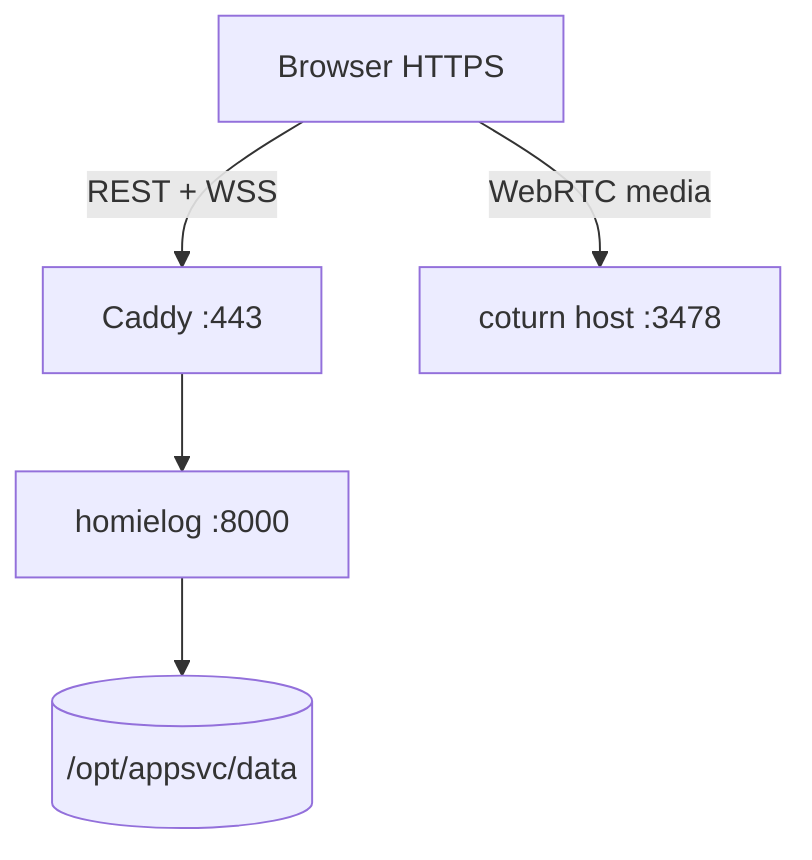

# HomieLog — Production deployment guide

This document is the **full replication runbook** for running HomieLog on a single Linux VM with **Docker** (app + Caddy HTTPS) and **coturn** (TURN) on the host. It matches the live setup on the `relay` Azure VM.

**Repository:** https://github.com/sayuru-j/homies-collection

**Related docs:** feature details and APIs → [DOCUMENTATION.md](./DOCUMENTATION.md)

---

## Table of contents

1. [What you get](#what-you-get)
2. [Current production snapshot](#current-production-snapshot)
3. [Architecture](#architecture)
4. [Prerequisites](#prerequisites)
5. [Azure VM and networking](#azure-vm-and-networking)
6. [DNS](#dns)
7. [VM preparation](#vm-preparation)
8. [Deploy application (Docker + Caddy)](#deploy-application-docker--caddy)
9. [Deploy TURN (coturn on host)](#deploy-turn-coturn-on-host)
10. [WebRTC / ICE configuration](#webrtc--ice-configuration)
11. [Updates and redeploy](#updates-and-redeploy)
12. [Backups](#backups)
13. [Smoke test checklist](#smoke-test-checklist)
14. [Troubleshooting](#troubleshooting)
15. [Replicating on a new VM or domain](#replicating-on-a-new-vm-or-domain)
16. [Optional: container registry CI](#optional-container-registry-ci)
17. [Files reference](#files-reference)

---

## What you get

| Component | How it runs | Port(s) |
|-----------|-------------|---------|
| **HomieLog** | Docker service `homielog` | 8000 (internal only) |
| **Caddy** | Docker service `caddy` | 80, 443 (public) |
| **coturn** | systemd on **host** (not Docker) | 3478 UDP/TCP, 49152–65535 UDP |
| **Data** | Bind mount `/opt/appsvc/data` → `/app/data` | — |

- **HTTPS** and **Let’s Encrypt** via Caddy (no `trustme` in production).
- **WebSockets** (`/ws`) proxied by Caddy automatically.
- **No database** — backup = copy `/opt/appsvc/data`.
- **Voice / video calls** use WebRTC + TURN on the same VM public IP.

---

## Current production snapshot

Use this table when comparing docs to what is live today. Change values when you move to a new server.

| Setting | Value |
|---------|--------|
| VM hostname (Azure) | `relay` (example discreet name) |
| Public IPv4 | `52.230.105.30` |
| App URL | https://app.green-valley.homes |
| DNS A record | `app` → `52.230.105.30` (TTL 600) |
| App root on VM | `/opt/appsvc` |
| Persistent data | `/opt/appsvc/data` |
| GitHub repo | `sayuru-j/homies-collection` |
| TURN public host | `52.230.105.30:3478` |
| TURN username | `homies` |
| TURN password | In `static/shared/js/ice-servers.js` and `/etc/turnserver.conf` (rotate together) |
| ICE config file | `static/shared/js/ice-servers.js` |

---

## Architecture

```
Internet
   │
   ├─ 443, 80/tcp ──► Caddy (Docker) ──► homielog:8000 (Docker)
   ├─ 3478 udp/tcp ──► coturn (host)
   └─ 49152–65535 udp ──► coturn relay

/opt/appsvc/          ← git clone, Dockerfile, compose, Caddyfile
/opt/appsvc/data/     ← JSON + media (survives container rebuilds)
```



---

## Prerequisites

- Azure (or any) **Ubuntu 22.04/24.04** VM, ~**2 vCPU / 4 GB RAM**, **32–64 GB** disk.
- A **domain** you control (for HTTPS).
- **Inbound ports** on cloud NSG and optionally `ufw` (see below).
- SSH access (`azureuser` or similar).

---

## Azure VM and networking

### VM sizing

- **2 vCPU / 4 GB RAM** — enough for a small friend group + coturn.
- Disk **32–64 GB** — grows with `data/media/`.

### Discreet naming (optional)

If the VM is on a shared/subscription account, use bland names:

| Resource | Example |
|----------|---------|
| VM | `relay`, `dev-log-01` |
| NSG | `nsg-relay-01` |
| Deploy path | `/opt/appsvc` (not `/opt/homies`) |

### NSG inbound rules

Create rules with boring names; **priority** 100, 110, …:

| Priority | Rule name | Port | Protocol | Purpose |
|----------|-----------|------|----------|---------|
| 100 | `Allow-SSH-Admin` | 22 | TCP | SSH — restrict source to **your IP** `/32` if possible |
| 110 | `Allow-HTTP-Web` | 80 | TCP | HTTP → HTTPS redirect + ACME |
| 120 | `Allow-HTTPS-Web` | 443 | TCP | HomieLog via Caddy |
| 130 | `Allow-STUN-TURN-Signaling` | 3478 | UDP | TURN |
| 140 | `Allow-STUN-TURN-Signaling-TCP` | 3478 | TCP | TURN (TCP fallback) |
| 150 | `Allow-Media-Relay-UDP` | 49152-65535 | UDP | TURN relay range |

### Host firewall (`ufw`, if enabled)

```bash
sudo ufw allow 22/tcp
sudo ufw allow 80,443/tcp
sudo ufw allow 3478/tcp
sudo ufw allow 3478/udp
sudo ufw allow 49152:65535/udp
```

---

## DNS

1. Create an **A** record: e.g. `app.yourdomain.com` → VM **public IPv4**.
2. Wait for propagation (`dig +short app.yourdomain.com A`).
3. Put the **exact hostname** in `Caddyfile` (see [Files reference](#files-reference)).

**TURN** does not need a DNS name; browsers use the **public IP** in `ice-servers.js`.

---

## VM preparation

SSH to the VM, then:

```bash
# Docker (official script)
curl -fsSL https://get.docker.com | sh
sudo usermod -aG docker "$USER"
# Log out and back in so docker works without sudo

# App directories
sudo mkdir -p /opt/appsvc/data
sudo chown -R 1000:1000 /opt/appsvc
```

Verify Docker:

```bash
docker run --rm hello-world
```

If `rsync` is missing, use `cp` (see deploy section) or `sudo apt-get install -y rsync`.

---

## Deploy application (Docker + Caddy)

### 1. Clone the repository

**Option A — clone directly into `/opt/appsvc`:**

```bash
sudo git clone https://github.com/sayuru-j/homies-collection.git /opt/appsvc
cd /opt/appsvc
sudo rm -rf .git   # optional: avoid accidental git pull as root issues
```

**Option B — clone to `/tmp` and copy (no `rsync`):**

```bash
cd /tmp
git clone https://github.com/sayuru-j/homies-collection.git
sudo cp -a /tmp/homies-collection/. /opt/appsvc/
sudo rm -rf /opt/appsvc/.git
```

**Private repo:**

```bash
git clone https://<TOKEN>@github.com/sayuru-j/homies-collection.git
```

### 2. Seed `data/` (optional)

If the repo or your laptop has existing `data/` (users, chats, media):

```bash
# From clone
sudo cp -a /tmp/homies-collection/data/. /opt/appsvc/data/ 2>/dev/null || true

# Or from your PC (PowerShell)
# scp -r C:\path\to\homies-collection\data\* azureuser@<VM_IP>:/tmp/data-upload/
# On VM:
# sudo cp -a /tmp/data-upload/. /opt/appsvc/data/
sudo chown -R 1000:1000 /opt/appsvc/data
```

**Warning:** Do not start with an **empty** `data/` over existing production data without a backup.

### 3. Configure Caddy hostname

Edit `Caddyfile` if your domain differs:

```caddyfile
app.green-valley.homes {
    reverse_proxy homielog:8000
}
```

Service name `homielog` must match `docker-compose.yml`.

### 4. Build and start

```bash
cd /opt/appsvc
sudo chmod +x deploy.sh
sudo docker compose up -d --build
sudo docker compose ps
```

### 5. Check logs

```bash
sudo docker compose logs caddy --tail 50
sudo docker compose logs homielog --tail 30
```

Open **https://your.domain** — first visit may take ~30–60s while Caddy obtains a Let’s Encrypt certificate.

### 6. `curl` checks

```bash
curl -4 ifconfig.me                    # VM public IP
dig +short app.green-valley.homes A   # must match
curl -sI https://app.green-valley.homes | head -5
```

---

## Deploy TURN (coturn on host)

Run coturn on the **host**, not inside Docker (simpler UDP relay port range).

### 1. Install

```bash
sudo apt-get update
sudo apt-get install -y coturn
```

### 2. Enable service

```bash
sudo sed -i 's/#TURNSERVER_ENABLED=1/TURNSERVER_ENABLED=1/' /etc/default/coturn
grep -q '^TURNSERVER_ENABLED=1' /etc/default/coturn || echo 'TURNSERVER_ENABLED=1' | sudo tee -a /etc/default/coturn
```

### 3. Configure `/etc/turnserver.conf`

Get the VM **private** IP (Azure NIC):

```bash
PRIVATE_IP=$(hostname -I | awk '{print $1}')
echo "relay-ip=$PRIVATE_IP"
```

Example config (also in `deploy/turnserver.conf.example`):

```conf
listening-port=3478
fingerprint
lt-cred-mech
user=homies:YOUR_PASSWORD
realm=52.230.105.30
external-ip=52.230.105.30
relay-ip=<PRIVATE_IP>
min-port=49152
max-port=65535
```

**Password must match** `static/shared/js/ice-servers.js` (`TURN_CREDENTIAL`).

Apply and restart:

```bash
sudo systemctl enable coturn
sudo systemctl restart coturn
sudo systemctl status coturn --no-pager
```

### 4. Verify TURN

```bash
turnutils_uclient -v -u homies -w 'YOUR_PASSWORD' 52.230.105.30
```

Expect `success` and `Received relay addr: 52.230.105.30:...`. Trailing `channel bind: error 403` in the test tool is often harmless for real browser calls.

---

## WebRTC / ICE configuration

All call features load **`/static/shared/js/ice-servers.js`** before call scripts:

| Page | HTML |
|------|------|
| HomieLog chat | `static/homielog/chat.html` |
| StrangerDanger | `static/stranger-danger/index.html` |

Call modules use `HOMIES_ICE_SERVERS`:

- `static/homielog/js/voice-call.js` (1:1)
- `static/homielog/js/group-mesh-call.js` (mesh group, ≤6 users)
- `static/stranger-danger/js/app.js`

To change TURN host or password, edit **only** `ice-servers.js`, redeploy Docker, hard-refresh browsers.

**Security:** credentials are visible in JS (acceptable for a private friend group). Prefer rotating password in coturn + `ice-servers.js` together; long-term improvement = short-lived TURN creds from API.

---

## Updates and redeploy

After pushing changes to GitHub:

```bash
cd /opt/appsvc
sudo git pull
sudo ./deploy.sh
# or: sudo docker compose up -d --build
```

`deploy.sh` rebuilds `homielog`, restarts compose, prunes old images.

**Hard-refresh** clients (Ctrl+Shift+R) after frontend/ICE changes.

### Production cookie hardening (recommended)

Behind HTTPS, set session cookies with `secure=True` in `app/routers/auth_routes.py` (currently `httponly` + `samesite=lax` only). Redeploy after changing.

---

## Backups

There is no database. Backup the data directory:

```bash
sudo mkdir -p /opt/appsvc/backups
sudo tar czf /opt/appsvc/backups/data-$(date +%F).tar.gz -C /opt/appsvc data
```

Restore:

```bash
sudo tar xzf /opt/appsvc/backups/data-YYYY-MM-DD.tar.gz -C /opt/appsvc
sudo chown -R 1000:1000 /opt/appsvc/data
sudo docker compose restart homielog
```

Optional cron (daily 03:00):

```bash
sudo crontab -e
# 0 3 * * * tar czf /opt/appsvc/backups/data-$(date +\%F).tar.gz -C /opt/appsvc data
```

---

## Smoke test checklist

| # | Test | Pass? |
|---|------|-------|
| 1 | https://your.domain loads login | |
| 2 | Register / login | |
| 3 | WebSocket presence (online list) | |
| 4 | Send text + image | |
| 5 | Beam / map location (needs HTTPS) | |
| 6 | 1:1 voice call on Wi‑Fi | |
| 7 | 1:1 voice call on phone LTE | |
| 8 | `ice-servers.js` loads in DevTools → Network | |
| 9 | `turnutils_uclient` success on VM | |

---

## Troubleshooting

| Problem | Likely fix |
|---------|------------|
| Site not loading | `docker compose ps`; NSG 443; DNS A record |
| Certificate error / timeout | Port **80** open (ACME); DNS points to VM; `docker compose logs caddy` |
| 502 Bad Gateway | `docker compose logs homielog`; container crashed — check `data/` permissions (`1000:1000`) |
| Chat works, calls fail on LTE | TURN: NSG 3478 + 49152–65535 UDP; coturn running; password matches `ice-servers.js` |
| Calls fail everywhere | Wrong `TURN_HOST` in `ice-servers.js`; `external-ip` / `relay-ip` wrong in turnserver.conf |
| `turnutils_uclient` fails | coturn not enabled; firewall; wrong `relay-ip` (must be Azure **private** IP) |
| Old TURN IP after migration | Update `ice-servers.js`, rebuild, hard-refresh |
| Empty app after deploy | Restored empty `data/` over production — restore from `backups/` |

---

## Replicating on a new VM or domain

1. Provision VM + NSG (same ports).
2. Point **new** A record → new public IP.
3. Update **`Caddyfile`** hostname.
4. Update **`static/shared/js/ice-servers.js`**: `TURN_HOST`, and coturn `realm` / `external-ip`.
5. On new VM, set coturn `relay-ip` to that VM’s **private** IP.
6. Clone repo to `/opt/appsvc`, `docker compose up -d --build`.
7. Copy **`/opt/appsvc/data`** from old VM if migrating (tar + scp).
8. Run [smoke test checklist](#smoke-test-checklist).

---

## Optional: container registry CI

Manual pipeline (no Azure DevOps required):

1. On PC: `docker build -t ghcr.io/<user>/homies:<git-sha> .` && `docker push ...`
2. On VM: set `homielog.image` in `docker-compose.yml` instead of `build: .`
3. SSH: `cd /opt/appsvc && ./deploy.sh`

Optional GitHub Action with `workflow_dispatch` and secrets: `GHCR_TOKEN`, `SSH_PRIVATE_KEY`, `DEPLOY_HOST`.

---

## Files reference

| File | Purpose |
|------|---------|
| `Dockerfile` | Python 3.12 image, Uvicorn on 8000 |
| `docker-compose.yml` | `homielog` + `caddy`, volume `/opt/appsvc/data` |
| `Caddyfile` | HTTPS site block → `homielog:8000` |
| `deploy.sh` | Rebuild and restart on VM |
| `.dockerignore` | Excludes `data/`, `venv/`, `certs/` from image |
| `deploy/turnserver.conf.example` | coturn template for host |
| `static/shared/js/ice-servers.js` | STUN/TURN URLs + credentials |
| `docker-compose.livekit.yml` | Optional LiveKit (group SFU); not used when `GROUP_CALLS_ENABLED = False` |

---

## Quick command summary (copy-paste)

**Full first-time deploy (after NSG + DNS):**

```bash
curl -fsSL https://get.docker.com | sh
sudo mkdir -p /opt/appsvc/data && sudo chown -R 1000:1000 /opt/appsvc
sudo git clone https://github.com/sayuru-j/homies-collection.git /opt/appsvc
cd /opt/appsvc && sudo chmod +x deploy.sh && sudo docker compose up -d --build
# coturn: see "Deploy TURN" section above
```

**Routine update:**

```bash
cd /opt/appsvc && sudo git pull && sudo ./deploy.sh
```

---

*Last updated for production on `relay` — app at https://app.green-valley.homes, TURN at 52.230.105.30.*
