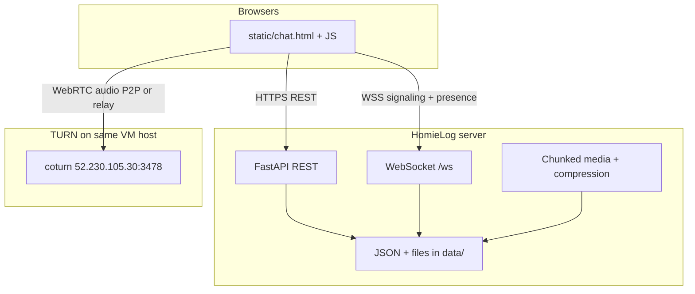

# HomieLog — Complete Project Documentation

HomieLog is a self-hosted chat application for friends and small groups. It runs on your machine (or a server) with **no external database**: conversations, users, and media are stored as JSON files and files on disk. The UI is a Discord-inspired web client; the backend is **FastAPI** with **WebSockets** for real-time updates.

This document describes the full system as built end-to-end, including setup, architecture, every major feature, HTTPS/voice calling, TURN relay, and operational notes.

**Production deployment (replicate on a new VM):** [DEPLOY.md](./DEPLOY.md) — Azure, Docker, Caddy, coturn, DNS, backups, redeploy.

---

## Table of contents

0. [Production deployment](./DEPLOY.md) (separate runbook)
1. [Quick start](#quick-start)
2. [Architecture](#architecture)
3. [Running HomieLog](#running-homielog)
4. [Authentication and sessions](#authentication-and-sessions)
5. [Chats, groups, and messaging](#chats-groups-and-messaging)
6. [Deleting conversations](#deleting-conversations)
7. [Group events and RSVP](#group-events-and-rsvp)
8. [Media: upload, compression, and progress](#media-upload-compression-and-progress)
9. [Voice messages](#voice-messages)
10. [Voice calls (1:1 WebRTC)](#voice-calls-11-webrtc)
11. [HTTPS and secure context](#https-and-secure-context)
12. [TURN server (Azure VM)](#turn-server-azure-vm)
13. [Real-time: WebSocket and presence](#real-time-websocket-and-presence)
14. [Settings UI](#settings-ui)
15. [Data on disk](#data-on-disk)
16. [API reference (summary)](#api-reference-summary)
17. [Frontend file map](#frontend-file-map)
18. [Troubleshooting](#troubleshooting)
19. [Suggested improvements](#suggested-improvements)

---

## Quick start

```bash
cd homies
pip install -r requirements.txt
```

**HTTP (PC only, simple dev):**

```bash
uvicorn app.main:app --reload --host 0.0.0.0 --port 8000
```

Open http://localhost:8000

**HTTPS (phones, mic, calls — recommended):**

```bash
python scripts/run_https.py --reload
```

Open https://127.0.0.1:7000 (or the LAN URL printed for your phone).

Register with a **name** and **6-digit PIN**, then chat from the sidebar.

---

## Architecture



| Layer | Technology |
|--------|------------|
| Backend | FastAPI, Uvicorn, aiofiles, Pydantic |
| Storage | JSON files under `data/` |
| Real-time | WebSocket (`app/presence.py`, `app/routers/ws.py`) |
| Frontend | Vanilla HTML/CSS/JS in `static/` |
| Voice calls | 1:1 WebRTC (`voice-call.js`); group SFU (`group-call.js` + LiveKit) |
| Dev HTTPS | `trustme` certs via `scripts/run_https.py` |
| NAT traversal | Google STUN + your coturn TURN server |

---

## Running HomieLog

### HTTP mode

```bash
uvicorn app.main:app --reload --host 0.0.0.0 --port 8000
```

- Good for desktop-only testing.
- **Microphone, camera, and WebRTC calls will not work on phones** unless you use `localhost` or HTTPS.

### HTTPS mode (port 7000)

Script: `scripts/run_https.py`

- Generates dev TLS certificates in `certs/` (gitignored) using **trustme**.
- Includes `localhost`, `127.0.0.1`, and your LAN IP in the cert SAN list.
- Runs Uvicorn with `--ssl-keyfile` and `--ssl-certfile`.

```bash
python scripts/run_https.py --reload
```

| Client | URL |
|--------|-----|
| PC | https://127.0.0.1:7000 |
| Phone (same Wi‑Fi) | https://YOUR_LAN_IP:7000 |

**Phone trust:** Install `certs/ca.pem` as a trusted CA, or accept the browser warning once.

**Windows:** Allow inbound TCP on port **7000** when the firewall prompts.

### Dependencies

See `requirements.txt`: FastAPI, Uvicorn, Pillow (image compression on server), **trustme** (dev HTTPS), etc.

**Optional:** `ffmpeg` on PATH for server-side video/voice compression.

---

## Authentication and sessions

- Users register/login with **display name** (or username) + **6-digit PIN** + **4-digit invite code**.
- Session token stored in an **HttpOnly** cookie (`session`).
- WebSocket accepts the same cookie (or `?token=` query param).

### Invite codes

| Source | When |
|--------|------|
| **Startup code** | Printed when the server starts (dev terminal or `docker compose logs homielog`) — see [DEPLOY.md § Registration invite codes](./DEPLOY.md#registration-invite-codes-docker-logs) |
| **Friend-generated** | Logged-in user: Settings → **Generate invite code** → `POST /api/users/invite-code` |

- Valid for **10 minutes**, single use, stored in `data/auth/invite_codes.json`.
- Implementation: `app/invite_codes.py`, triggered from `app/main.py` startup.

Auth data: `data/auth/users.json`, `data/auth/sessions.json`, `data/auth/invite_codes.json`  
Profiles: `data/profiles/{user_id}.json`

---

## Chats, groups, and messaging

### Direct messages (DM)

- Chat ID format: `dm_{userA}_{userB}` (sorted user IDs).
- Opened via user list or `/api/chats/dm/{peer_id}`.

### Groups

- Created from **Create a group** modal.
- Chat ID: `group_{group_id}`.
- Creator is always a member; friends are selected with a **tap-to-select** list (avatars, online badge, search, selected count).
- System message when group is created.

### Message types

| Type | Description |
|------|-------------|
| `text` | Plain text |
| `image` | Image attachment |
| `video` | Video attachment |
| `voice` | Voice message (recorded in browser) |
| `system` | Centered line (e.g. history deleted, group created) |

### Message UI

- Discord-style message groups (avatar, compact consecutive messages from same sender).
- **Separators** between message blocks (non-compact groups).
- **Own messages** aligned/styled distinctly.
- **Per-message menu (⋮):** Delete message (for your messages).
- Long-press / context menu on touch devices.
- Paginated history: load older messages when scrolling up.

### Chat toolbar

- **Back** (mobile).
- **Voice call** button (DM only) — see [Voice calls](#voice-calls-11-webrtc).
- **⋮ menu:** Delete conversation (for everyone, soft-delete).

### Scroll behavior

- Opening a chat scrolls to the **newest** messages.
- Stays pinned to bottom until the user scrolls up.
- New messages auto-scroll if you were already at the bottom.

---

## Deleting conversations

HomieLog supports two levels of deletion for **all members** (not per-user-only hiding).

### Soft delete (“Delete conversation”)

- From chat **⋮ → Delete conversation**.
- Marks the chat deleted in **every member’s** profile settings.
- Chat disappears from the sidebar for everyone.
- **Messages and files remain on disk.**
- Appends a **system message**: `{Name} deleted the history`
- Restorable from **Settings → Deleted Chats**.

### Restore

- **Settings → Deleted Chats → Restore** brings the chat back for all members who had it deleted.

### Permanent delete

- Only from **Deleted Chats** after soft-delete.
- **Purges server data:** chat JSON, group JSON (if applicable), all message media, chunk uploads.
- Not restorable from settings.
- WebSocket event `chat_purged` closes the chat view if open.

Implementation: `app/chat_soft_delete.py`, routes in `app/routers/chats.py`.

---

## Group events and RSVP

Group members can schedule **events** with **Going** / **Not going** RSVP. Events are stored as JSON under `data/events/{event_id}.json`.

### Sidebar

- **Events** section (between Online and Direct Messages) lists upcoming events from **all groups** you belong to (within the last 24 hours of start time or later).
- From a **group chat**, **⋮ → Create event** opens the create-event modal (pre-selects that group).

### Event detail

Selecting an event opens a detail panel (replaces the message stream): time, location, description, RSVP counts, attendee lists, and **Going** / **Not going** buttons. The **creator** or **group owner** can delete the event from the toolbar **⋮ → Delete event**.

### Group chat integration

Creating an event posts a **system message** in the group chat (e.g. `Event: Movie night — May 25, 2026 19:00 UTC`). RSVP changes do **not** spam the chat.

### Real-time

WebSocket payloads to all group members:

- `event_updated` — create, edit, or RSVP
- `event_deleted` — event removed

Clients refresh the Events list and the open detail view when applicable.

### API

| Method | Path | Description |
|--------|------|-------------|
| GET | `/api/events` | Upcoming events for the current user |
| POST | `/api/groups/{group_id}/events` | Create event (creator auto-RSVPs **going**) |
| GET | `/api/events/{event_id}` | Full detail and member RSVP lists |
| PATCH | `/api/events/{event_id}` | Update (creator or group owner) |
| DELETE | `/api/events/{event_id}` | Delete (creator or group owner) |
| PUT | `/api/events/{event_id}/rsvp` | Body `{ "status": "going" \| "not_going" }` |

Implementation: `app/routers/events.py`, `static/js/events.js`.

---

## Media: upload, compression, and progress

### Chunked upload

Large files upload in **256 KB** chunks (`static/js/api.js` → `uploadChunked`).

- Works for images, videos, voice, avatars.
- Uses a generated upload ID (`newUploadId()` with fallbacks for browsers without `crypto.randomUUID`).

### Client-side compression

`static/js/media-compress.js` — runs in the browser before upload when compression &lt; 100% (canvas + MediaRecorder for video; Web Audio for voice).

- **Setting:** Settings → **Media** tab → slider **0% to 100%** (default **90%**; 100% = no compression). Slider is **green** from 20–90% and **red** below 20% or above 90%.
- Stored in profile: `media_compression_percent`.
- Shows **progress**, estimated size, and summary (`original → compressed (−N%)`).

### Where compression runs

- **Chat uploads (image, video, voice):** `static/js/media-compress.js` in the browser before chunked upload.
- **Profile avatar** (`/api/media/avatar`): optional Pillow pass on the server (`app/media_compress.py`).

### Cancel uploads

Transfer can be aborted when:

- Leaving the chat
- Switching chats
- Removing attachment preview
- Pressing Cancel

Uses `AbortController` in `api.js` (`beginActiveTransfer` / `cancelActiveTransfer`).

---

## Voice messages

- **Hold** the mic button in the composer to record (not tap).
- Mobile-safe: `getUserMedia` with secure-context checks, legacy APIs, preferred MIME types (iOS/webm).
- Uploaded as `voice` media type; playback UI with waveform bars and progress.

Requires **HTTPS** (or localhost) on phones.

---

## Voice calls (1:1 WebRTC)

**Scope:** Direct messages only. Group calls use LiveKit (see below).

### User flow

1. Open a DM → **phone icon** in the toolbar.
2. Callee sees **incoming call** overlay → Accept / Decline.
3. During call: **mute** and **end** (red button).

### Technical flow

1. Caller gets microphone, creates `RTCPeerConnection`, sends **offer** inside `call_invite`.
2. Signaling travels over the existing **WebSocket** (not a separate server).
3. Callee accepts → **answer** + ICE candidates exchanged (`call_ice`).
4. Audio plays via a hidden `<audio autoplay>` element.

### Signaling message types

| Client → server | Server → peer |
|-----------------|---------------|
| `call_invite` | `call_incoming` |
| `call_answer` | `call_answer` |
| `call_ice` | `call_ice` |
| `call_reject`, `call_end`, `call_cancel` | same |
| `call_busy` | `call_busy` |

Relay logic: `app/call_signaling.py`, wired in `app/routers/ws.py`.

### ICE servers (`static/shared/js/ice-servers.js`)

```javascript
const ICE_SERVERS = [
  { urls: "stun:stun.l.google.com:19302" },
  { urls: "stun:stun1.l.google.com:19302" },
  {
    urls: [
      "turn:52.230.105.30:3478?transport=udp",
      "turn:52.230.105.30:3478?transport=tcp",
    ],
    username: "homies",
    credential: "<your-turn-password>",
  },
];
```

- **STUN** helps with simple NAT.
- **TURN** relays media when P2P fails (phone on LTE, strict routers).

**Security note:** TURN credentials in JS are visible to clients. For a private friend group this is acceptable; rotate the password if exposed. Production setups often use **short-lived TURN credentials** from the API.

### Files

| File | Role |
|------|------|
| `static/js/voice-call.js` | WebRTC state machine + UI hooks |
| `static/js/chat.js` | Call button, overlay, WebSocket dispatch |
| `static/chat.html` | Call overlay markup |
| `static/css/discord.css` | Call overlay styles |
| `app/call_signaling.py` | Relay signaling to peer |

---

## Group calls

**Scope:** Group chats (`group_*`).

| Group size | Technology | Server needed |
|------------|------------|---------------|
| Up to **6** members (default) | **Mesh WebRTC** — same as 1:1 (`group-mesh-call.js`) | HomieLog + your existing TURN |
| **7+** members | **LiveKit SFU** (`group-call.js`) | LiveKit server + env vars |

Small friend groups work **without LiveKit**. Larger groups use the SFU when `LIVEKIT_*` is configured.

### Small groups — mesh WebRTC

Same signaling types as 1:1 (`call_offer`, `call_answer`, `call_ice`), plus:

| Client → server | Server → members |
|-----------------|------------------|
| `call_mesh_invite` | `call_mesh_incoming` |
| `call_mesh_join` | `call_mesh_peer_joined` |
| `call_mesh_end` | `call_mesh_ended` |

Relay: `app/group_call_signaling.py`. Each participant connects to every other (fine for ≤6 people).

### Large groups — LiveKit SFU

### Setup

1. Start LiveKit (example on the same machine):

   ```bash
   docker compose -f docker-compose.livekit.yml up -d
   ```

2. Set environment variables for HomieLog (see `.env.example`):

   | Variable | Example |
   |----------|---------|
   | `LIVEKIT_URL` | `ws://127.0.0.1:7880` (use `wss://` behind HTTPS proxy) |
   | `LIVEKIT_API_KEY` | `devkey` (must match `livekit.yaml`) |
   | `LIVEKIT_API_SECRET` | `secret` |

3. Restart HomieLog with those variables exported.

4. Open a **group chat** → phone / video toolbar buttons (same as DM when LiveKit is configured).

### User flow

1. A member starts a group call → others receive **`call_room_incoming`** over WebSocket.
2. Accept → browser joins the LiveKit room named after **`chat_id`** (e.g. `group_<uuid>`).
3. Anyone in the group can also tap the call button to **join** an active room without a separate invite.
4. **End** leaves the room; when the last person ends, a **call log** system message is posted (same API as 1:1).

### API

| Method | Path | Purpose |
|--------|------|---------|
| GET | `/api/calls/config` | `{ enabled, url }` for the client |
| POST | `/api/calls/group/token` | Body: `{ chat_id, call_mode }` → JWT + room name |

Membership is checked server-side before issuing a token.

### WebSocket (invites only — not media SDP)

| Client → server | Server → members |
|-----------------|------------------|
| `call_room_invite` | `call_room_incoming` |
| `call_room_end` | `call_room_ended` |

Relay: `app/group_call_signaling.py`. Media flows through **LiveKit**, not HomieLog.

### Files

| File | Role |
|------|------|
| `static/js/group-call.js` | LiveKit room client + UI state |
| `app/livekit_service.py` | Access token generation |
| `app/routers/calls.py` | Config + token API |
| `docker-compose.livekit.yml` | Optional local LiveKit server |

For production at scale, run LiveKit on a dedicated host with UDP ports open and `wss://` via a reverse proxy.

---

## HTTPS and secure context

Browsers restrict microphone, camera, and many APIs to **secure contexts**:

- `https://`
- `http://localhost` (exception)

HomieLog dev HTTPS uses self-signed **trustme** certificates. Traffic is **encrypted in transit** between browser and your HomieLog server.

| What HTTPS protects | What it does not do |
|---------------------|---------------------|
| Wi‑Fi sniffing of chat/API traffic | Hide data from the server (not E2E encrypted) |
| Session cookies on the wire | Stop other logged-in users reading group chats |
| Safe mic access on phones | Replace need for TURN on hard NAT |

---

## TURN server (Azure VM)

**coturn** runs on the **host** (systemd), not in Docker, on the same VM as the app (`relay`). Full install steps, NSG, DNS, and redeploy: **[DEPLOY.md](./DEPLOY.md)**.

You deployed **coturn** for relay when WebRTC cannot connect peer-to-peer.

### Server details (your setup)

| Setting | Value |
|---------|--------|
| Public IP | `52.230.105.30` (`relay` VM, same as `app.green-valley.homes`) |
| Private IP (Azure) | Your NIC private IP — set as `relay-ip` in coturn (see `deploy/turnserver.conf.example`) |
| Port | `3478` (UDP + TCP) |
| Relay ports | `49152–65535` (UDP) |
| Username | `homies` |
| Password | Set in `/etc/turnserver.conf` (rotate if shared) |

### coturn config highlights (`/etc/turnserver.conf`)

```conf
listening-port=3478
fingerprint
lt-cred-mech
user=homies:YOUR_PASSWORD
realm=52.230.105.30
external-ip=52.230.105.30
relay-ip=<AZURE_PRIVATE_IP>
min-port=49152
max-port=65535
```

### Azure NSG inbound rules

- **3478** UDP and TCP  
- **49152–65535** UDP  

### Verify TURN

```bash
turnutils_uclient -v -u homies -w 'YOUR_PASSWORD' 52.230.105.30
```

Look for `success` and `Received relay addr: 52.230.105.30:...`. A trailing `channel bind: error 403` in the test tool is often harmless for real browser calls.

ICE config in the app: `static/shared/js/ice-servers.js` (loaded before call scripts).

### Domain

**Not required.** TURN works with the public IP only. A domain is optional for TLS (`turns:` on port 5349).

---

## Real-time: WebSocket and presence

**Endpoint:** `wss://host/ws` (or `ws://` on HTTP)

| Event | Purpose |
|-------|---------|
| `connected` | Initial connection + online list |
| `presence` | Who is online (updates lists) |
| `message` | New chat message |
| `message_deleted` | Message removed |
| `chat_purged` | Permanent chat deletion |
| `event_updated` | Group event created, edited, or RSVP changed |
| `event_deleted` | Group event removed |
| Call signaling | See [Voice calls](#voice-calls-11-webrtc) |

Ping/pong every 30s from the client.

---

## Settings UI

**Gear icon** on the user panel (bottom of sidebar).

| Tab | Contents |
|-----|----------|
| **My Account** | Avatar, display name, **Log out** |
| **Media** | Compression slider (0–100%, default 90%; green 20–90%, red otherwise) |
| **Deleted Chats** | Restore or permanently delete |

Mobile chat header **no longer** has a separate settings button (reduces clutter). Log out moved from the bottom bar into settings.

### User panel

- Safe-area padding for notched phones.
- Display name shown; “Display name” heading/description removed from account form per UX preference.

---

## Data on disk

```
data/
  auth/users.json          # accounts
  auth/sessions.json       # active sessions
  profiles/{user_id}.json  # display name, avatar, settings (deleted chats, compression %)
  chats/{chat_id}.json     # messages array
  groups/{group_id}.json   # group metadata
  events/{event_id}.json   # group events + RSVPs
  media/{user_id}/{type}/  # uploaded files
  uploads/chunks/          # temporary chunk storage during upload
```

**Gitignore:** `certs/` (dev TLS), virtualenvs, `.env` if used.

---

## API reference (summary)

Prefix: `/api` unless noted.

### Auth

| Method | Path | Description |
|--------|------|-------------|
| POST | `/auth/register` | Register |
| POST | `/auth/login` | Login |
| POST | `/auth/logout` | Logout |

### Users

| Method | Path | Description |
|--------|------|-------------|
| GET | `/users/me` | Current user + profile |
| PATCH | `/users/me` | Update profile / compression |
| GET | `/users/all` | All users (for sidebar) |

### Chats

| Method | Path | Description |
|--------|------|-------------|
| GET | `/chats/list` | Sidebar conversations |
| GET | `/chats/dm/{peer_id}` | Open/create DM |
| GET | `/chats/{chat_id}/messages` | Paginated messages |
| POST | `/chats/send` | Send message |
| DELETE | `/chats/{chat_id}/messages/{id}` | Delete one message |
| DELETE | `/chats/{chat_id}` | Soft-delete for all + system message |
| POST | `/chats/{chat_id}/restore` | Restore for all |
| DELETE | `/chats/{chat_id}/permanent` | Purge from server |
| GET | `/chats/deleted` | Deleted chats list |

### Groups

| Method | Path | Description |
|--------|------|-------------|
| POST | `/groups/create` | Create group + chat |
| POST | `/groups/{group_id}/events` | Create group event |

### Events

| Method | Path | Description |
|--------|------|-------------|
| GET | `/events` | Upcoming events for current user |
| GET | `/events/{event_id}` | Event detail + RSVP lists |
| PATCH | `/events/{event_id}` | Update event |
| DELETE | `/events/{event_id}` | Delete event |
| PUT | `/events/{event_id}/rsvp` | Set RSVP (`going` / `not_going`) |

### Media

| Method | Path | Description |
|--------|------|-------------|
| POST | `/media/chunk` | Chunked upload |

### WebSocket

| Path | Description |
|------|-------------|
| `/ws` | Presence, messages, call signaling |

Static media: `/media/{user_id}/{type}/{filename}`

---

## Frontend file map

Static files are grouped by site under `static/` (see `static/README.md`).

### HomieLog (`static/homielog/`)

| File | Purpose |
|------|---------|
| `index.html` | Login / register (`/`) |
| `chat.html` | Main app shell, modals, call overlay (`/chat`) |
| `js/chat.js` | Core UI, messages, WS, calls integration |
| `js/events.js` | Group events sidebar, detail view, RSVP |
| `js/bored-wheel.js` | Bored feature menu (buttons → StrangerDanger, etc.) |
| `js/media-compress.js` | Client compression before upload |
| `js/voice-call.js` | WebRTC 1:1 voice calls |
| `js/group-call.js` | Group calls via LiveKit SFU |
| `css/discord.css` | Main theme + call overlay |

### StrangerDanger (`static/stranger-danger/`)

| File | Purpose |
|------|---------|
| `index.html` | Standalone stranger video chat (`/stranger-danger`) |
| `js/app.js` | Queue matching, WebRTC (`sd_*` signaling) |
| `css/site.css` | Neo-brutalist standalone UI (no HomieLog branding on page) |

### Shared (`static/shared/js/`)

| File | Purpose |
|------|---------|
| `api.js` | REST, chunked upload, session cookies |
| `icons.js` | Lucide icon helpers (HomieLog) |

---

## Troubleshooting

| Problem | Likely fix |
|---------|------------|
| Mic/voice not working on phone | Use `python scripts/run_https.py`, open HTTPS URL |
| `crypto.randomUUID is not a function` | Fixed via `newUploadId()` in `api.js` — hard refresh |
| Video upload fails after compress on mobile | Same as above (upload ID) |
| Call connects on Wi‑Fi but not LTE | Ensure TURN is in `ICE_SERVERS` and Azure UDP ports open |
| `turnutils_uclient` success but 403 at end | Usually OK; test real browser call |
| Port 7000 in use | Stop other HomieLog/uvicorn or change `--port` |
| Chat deleted but no system line | Ensure latest `chats.py` delete handler |
| Permanent delete still shows media | Use purge path; check `purge_chat_from_server` |

---

## Suggested improvements

- **TURN credentials from API** (time-limited) instead of hardcoded in JS.
- **Rotate TURN password** after documenting or sharing it.
- **Video calls** (same signaling, add video tracks).
- **Production LiveKit** (TLS, autoscaling, telemetry) for large deployments.
- **End-to-end encryption** (Signal-style; major undertaking).
- **Session cookies:** `secure=True` in production (`auth_routes.py`) — see [DEPLOY.md](./DEPLOY.md).
- **Short-lived TURN credentials** from API instead of static JS.

---

## Changelog (features added in this development arc)

1. Mobile voice recording fixes (`getUserMedia`, HTTPS hints, MIME types).
2. Per-message delete via ⋮ menu (not always-visible trash).
3. Video message player sizing (no extra letterboxing).
4. Scroll-to-bottom behavior with stick-to-bottom logic.
5. Configurable media compression (Settings → Media, default 90%).
6. User panel safe-area + logout in settings.
7. Chat delete for **all members** + server purge on permanent delete.
8. Message block separators.
9. Upload compression progress, size estimates, cancel on navigation.
10. Group creation: tap-to-select friends UI.
11. `crypto.randomUUID` fallback for mobile uploads.
12. HTTPS dev server (`scripts/run_https.py`, port **7000**).
13. **1:1 voice calls** (WebRTC + WebSocket signaling).
16. **Group calls** (LiveKit SFU, `static/js/group-call.js`, token API).
14. System message when conversation history is deleted.
15. **TURN server** on the `relay` VM (`52.230.105.30`) via `static/shared/js/ice-servers.js`.

---

*HomieLog — built for your homies, hosted by you.*
